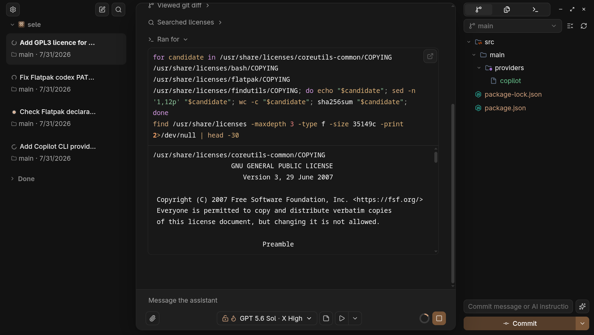

# Sele

A focused desktop workspace for working with AI coding agents across local projects.



Sele keeps conversations, project context, diffs, file editing, and terminal sessions together
in one desktop app. It currently supports OpenAI Codex and GitHub Copilot.

## Install

Download the latest Windows, macOS, or Linux package from
[GitHub Releases](https://github.com/Chipi-Chapa-Corp/sele/releases/latest).

Install the Linux Flatpak from Sele's update repository:

```bash
flatpak install --user https://chipi-chapa-corp.github.io/sele/flatpak/sele.flatpakref
```

Install on macOS with Homebrew:

```bash
brew tap chipi-chapa-corp/sele https://github.com/Chipi-Chapa-Corp/sele.git
brew install --cask chipi-chapa-corp/sele/sele
```

> [!IMPORTANT]
> macOS builds are currently unsigned. If Gatekeeper says Sele is damaged, corrupted, or
> cannot be opened, remove the download quarantine and start the app again:
>
> ```bash
> sudo xattr -dr com.apple.quarantine /Applications/Sele.app
> open /Applications/Sele.app
> ```

Sele uses the coding-agent CLIs, Git, and shell installed on your host system. Install and
authenticate the CLI you want to use before starting Sele.

```bash
codex --version
copilot --version
```

For Copilot, start `copilot` once and use `/login` if the CLI is not already authenticated.

## Development

Requires Node.js 22.

```bash
npm install
npm run dev
```

Run the project checks with:

```bash
npm run lint
npm run typecheck
npm run build
```

## License

[GNU General Public License v3.0 only](LICENSE)
